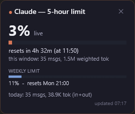

# Claude Usage Widget

A small, always-on-top desktop widget for Windows that shows how much of your
**Claude 5-hour limit** (and weekly limit) you've used — in a box you can drag
anywhere on screen. Built with PowerShell + WPF, no install of Node/Python
required.

  

> **Not affiliated with Anthropic.** This is an unofficial community tool. It
> reads usage data from undocumented Anthropic endpoints (the same ones other
> community usage monitors use), so it may stop working without notice if those
> change. Use at your own risk.

---

## Features

- **Live 5-hour limit %** with a color-coded bar (turns amber at 70%, red at 90%)
- **Weekly limit %** and reset countdowns
- **Always on top**, frameless, drag it anywhere — remembers its position
- **Auto-starts** with Windows
- Renews your login automatically in the background, so it keeps working day to day
- Falls back to a local **estimate** mode if it can't reach the live data

## Requirements

- Windows 10/11
- A Claude **Pro or Max** subscription (the limit data comes from your account)
- That's it — the setup installs the small `claude` CLI it needs for authentication

## Install

1. **Download** this repo (green **Code** button → *Download ZIP*) and unzip it,
   or `git clone` it.
2. Double-click **`Setup.cmd`**.
3. If prompted, sign in to your Claude account in the browser once.

The widget appears on screen, starts automatically with Windows, and you can drag
it wherever you like. Click the **✕** on it to close; reopen it any time from the
**"Claude Usage Widget"** desktop shortcut the setup creates.

## How it works

- It reads your Claude login from `~/.claude/.credentials.json` and polls Anthropic's
  OAuth usage endpoint every few minutes for your exact limit percentages.
- When the access token expires (about every 8 hours) it asks the `claude` CLI to
  renew it — the same supported mechanism that keeps the CLI logged in for days.
  The widget never calls the token-refresh endpoint directly (doing so gets the
  account rate-limited).
- The label next to the big number tells you the data source:
  - **`live`** — exact numbers straight from your account
  - **`est.`** — a local estimate (shown if the login is missing or the endpoint
    is unreachable)

## Troubleshooting

- **Stuck on `est.`?** Run **`Relogin.cmd`** to do a fresh 30-second sign-in.
- **Widget closed / gone?** Double-click the desktop shortcut, or run
  `ClaudeUsageWidget.ps1` directly (right-click → *Run with PowerShell*).
- **Want it to stop auto-starting?** Delete *"Claude Usage Widget"* from your
  Startup folder (`shell:startup`).

## Uninstall

Delete the *"Claude Usage Widget"* shortcuts from your Desktop and from
`shell:startup`, then delete the `%USERPROFILE%\ClaudeUsageWidget` folder.

## License

[MIT](LICENSE) — free to use, modify, and share.
